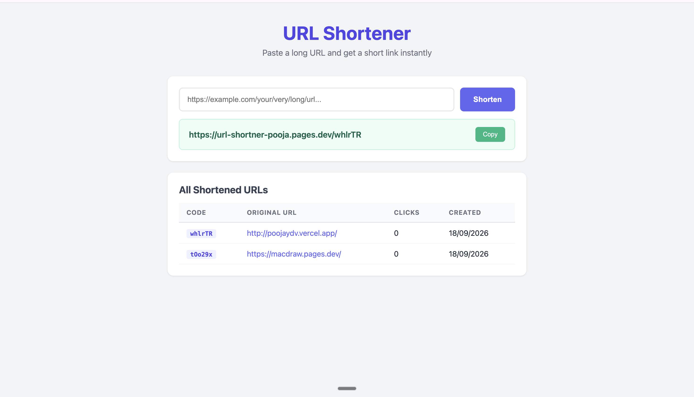
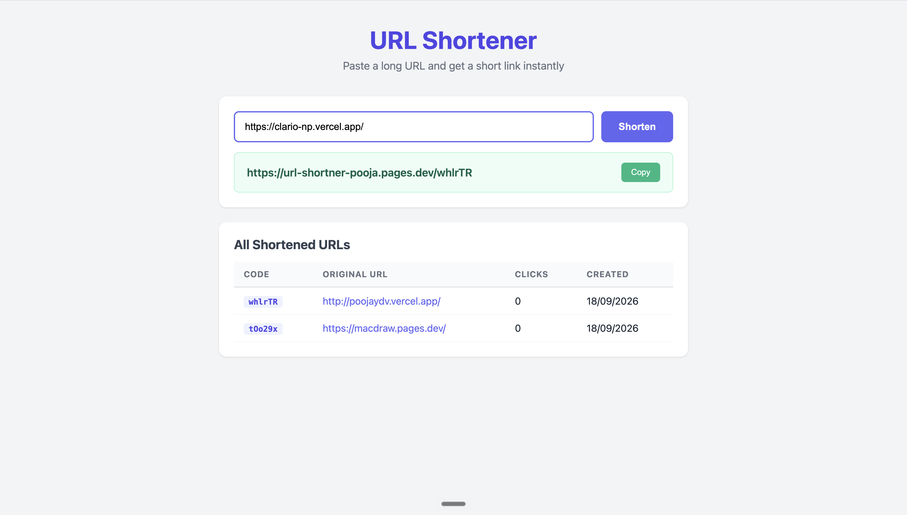

# 🔗 url-shortner — Short URL Maker

A URL shortener website built by ** me pooja yadav** that takes long links and turns them into small short ones, made with love for the web.

## Description

This is my URL shortner project, where you can paste any long url and get a short link you can share easily. It is a place where I am learning how to connect a frontend with a real database and deploying things in the cloud.

The project is built using **html, css, javascript** for the frontend, and the links are stored in **supabase** (a Postgres database) &hosted on **Cloudflare Pages**. There is also a small **Rust** backend included using Axum, because im exploring rust too, but the live website does not need it.

It works like this: the frontend talks directly to supabase to create a short code for your url, and when anyone visits the short link, a cloudflare function looks up the url, counts the click, and redirects them to the original site.

The project is still a work in progress, and I plan to keep improving it with more features, better design, and more learning as I go.

> built with curiosity, and a lot of ❤️ by pooja yadav**.

## Screenshots

Add at least one screenshot of the url shortner here.

eg:




## Getting Started

### Dependencies

Before running the project, make sure you have:

* **rust** and cargo installed, or **Node.js** with wrangler
* A modern web browser such as Chrome, Safari.
* **git** (optional, if cloning the repository)
* A **supabase** account with a table called `url`

The live website is hosted on **cloudflare pages** using wrangler.

### Installing

Clone the repository:

```bash
git clone [click me ](https://github.com/Poojayadav0909/url-shortner)
```

Move into the project folder:

```bash
cd url-shortner
```

Install the dependencies:

```bash
cargo build
```

or if you have bun as well:

```bash
bun install
```

### Executing program

First create the `urls` table in Supabase by opening the SQL editor and running the query from `sql/1.sql`.

Start the local server:

```bash
cargo run
```

Then open the local URL shown in your terminal, usually->

```text
http://localhost:3000
```

The exact port may be different depending on your project configuration.

For the live deployment you can do:

```bash
wrangler pages deploy public --project-name url-shortner-pooja
```

## Help

If the project does not start, try reinstalling the dependencies:

```bash
rm -rf target
cargo build
cargo run
```

make sure you have run the sql file in supabase, otherwise you will see a table not found error
If wrangler is not installed, install it from the official cloudflare website with node 22 or newer

Make sure you are running the commands from the project directory

## License

This project is currently a personal url shortner project. No specific open-source license has been added yet